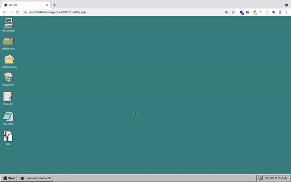

# 🌍Window 98 Chrome App

## 프로젝트 정보

## 0. 소개

🌎 [Window 98](https://guidebookgallery.org/screenshots/win98)을 참고해서 HTML, CSS, 자바스크립트로 웹 어플리케이션을 만드는 프로젝트입니다.

🔗 배포 링크: [win98 chrome app](https://unruffled-brahmagupta-b81ab7.netlify.app/)


## 1. 실행 방법

- CORS 에러를 방지하기 위해 [live-server](https://marketplace.visualstudio.com/items?itemName=ritwickdey.LiveServer)를 활용하여 실행합니다.

> Open `index.html` with **Live Server**

## 2. 파일 구조

```
├── src/
	 ├── components/          - 컴포넌트 파일
			├── Startup.js
			├── Todo.js
			├── TextEditor.js
	 ├── App.js               - 컴포넌트 정의
	 ├── Component.js         - 컴포넌트 구현
   ├── index.js             - entry point
├── style/                  - css 파일
├── index.html

* eslint, prettier 설정 파일

```

## 3. 주요 기능

### Todo App


- 할일 추가/ 삭제

### Text Editor



- 텍스트 입력/ 삭제
- 텍스트 크기, 스타일, 폰트, 위치 조정

### Painting App(진행 중)

- 캔버스 선, 도형 그리기/ 지우기
- 선 색깔 변경

---

## 기존 코드의 문제점 개선

### 1. HTML 코드가 반복되고 및 무거워지는 문제

- 반복 작업을 `map`을 통해 렌더링합니다.

  ```html
  <!-- 같은 구조 반복 -->
  <div class="icon-group">
    <!-- ... -->
    <div id="todo" class="icon todo" tabindex="0">
      <strong>ToDo List</strong>
    </div>
    <div id="editor" class="icon editor" tabindex="0">
      <strong>Text Editor</strong>
    </div>
    <div id="paint" class="icon paint" tabindex="0">
      <strong>Paint</strong>
    </div>
  </div>

  <!-- 리팩토링  -->
  <!-- App.js -->
  const { data } = this.state; return `
  <div class="icon-group">
    ${data.map((list, key) => `
    <div class="icon">
      <strong class="icon-name">${list.icon}</strong>
    </div>
    ` ).join("")}
  </div>
  `
  ```

### 2. `<script>` 로 가져오는 외부 자바스크립트 파일 증가

- `script` 타입을 `module`로 설정해서 **모듈레벨 스코프**를 만듭니다.

  ```html
  <body>
    <!-- ... -->
    <script src="./index.js"></script>
    <script src="./script/clock.js"></script>
    <script src="./script/modal.js"></script>
    <script src="./script/todo.js"></script>
    <script src="./script/texteditor.js"></script>
    <script src="./script/paint.js"></script>
    <script src="./script/paint-tools.js"></script>
  </body>

  <!-- 리팩토링  -->
  <!-- index.html -->

  <body>
    <div id="root"></div>
    <script src="./src/index.js" type="module"></script>
  </body>
  ```

- 자바스크립트 파일을 **컴포넌트** 구조로 리팩토링 했습니다.

  ```js
  // Component.js
  export default class Component {
    constructor(target) {
      this.target = target; // event target
      this.initailize();
      this.setEvent();
      this.render();
    }

    // 초기화
    initailize() {}

    // 뷰(마크업)
    template() {
      return "";
    }

    // 렌더링
    render() {
      this.target.innerHTML += this.template();
      this.setEvent();
    }

    // 이벤트 함수
    setEvent() {}

    // 상태 업데이트
    setState(newState) {
      this.state = { ...this.state, ...newState };
      this.render();
    }
  }
  ```

- ES6의 `class` 문법으로 작성해서 **컴포넌트** 코드의 사용법을 패턴화합니다.

  ```js
  // App.js 예시
  import Todo from "./components/Todo.js";
  import TextEditor from "./components/TextEditor.js";

  class App {
    constructor() {
      const app = document.querySelector("#root");

      new Todo(app);
      new TextEditor(app);
    }
  }

  new App();
  ```

---

### 레퍼런스

[98.css](https://jdan.github.io/98.css/)
