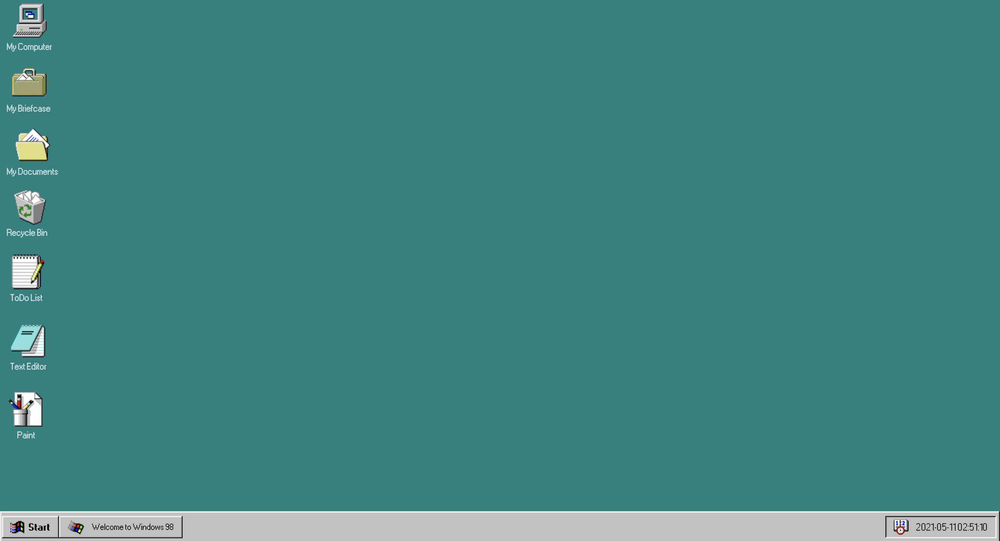
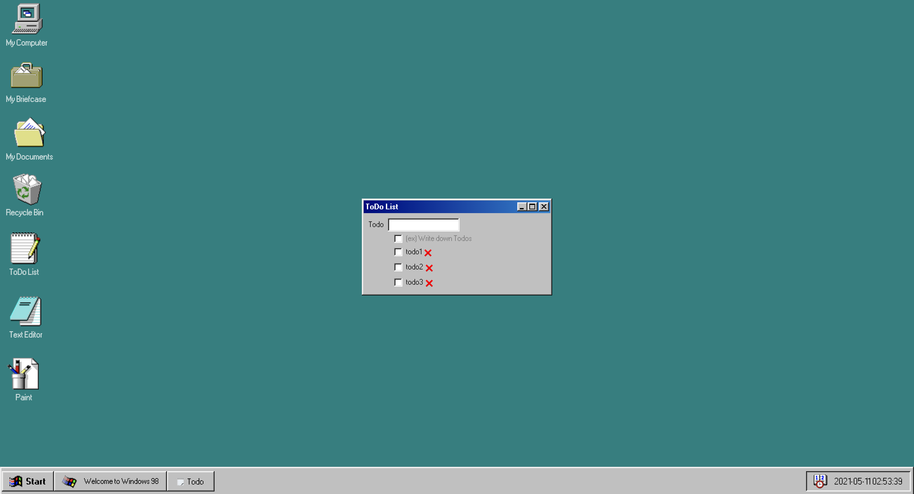
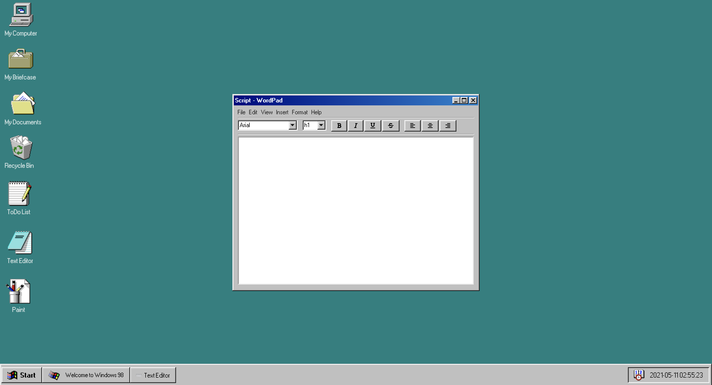

# 🌍Window 98 Chrome App

## 프로젝트 소개

> [window 98](https://guidebookgallery.org/screenshots/win98)을 참고하여 HTML, CSS, 자바스크립트로 웹 어플리케이션을 만드는 프로젝트입니다. 

## 프로젝트 링크

🔗 [win98 chrome app](https://unruffled-brahmagupta-b81ab7.netlify.app/)

  

## 주요 기능

### Todo App

  

- 할일 추가/ 삭제

### Text Editor

  

- 텍스트 입력/ 삭제
- 텍스트 크기, 스타일, 폰트, 위치 조정

### Painting App(진행 중)

- 캔버스 선, 도형 그리기/ 지우기
- 선 색깔 변경

---

### 레퍼런스

[98.css](https://jdan.github.io/98.css/)
